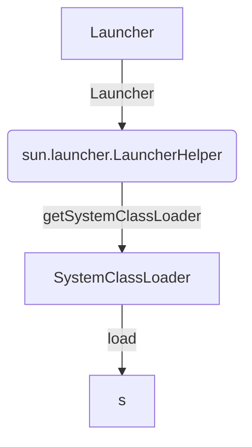

## Espresson加载方式

```mermaid
flowchart TD
    A[Launcher] -->|Launcher| B(sun.launcher.LauncherHelper)
    B --> |getSystemClassLoader|C[SystemClassLoader]
    C --> |load|AppClassLoader[s]
    
```
1. Launch启动
2. 使用Polyglot加载 sun.launcher.LauncherHelper.checkAndLoadMain 加载主类
3. scloader.loadClass